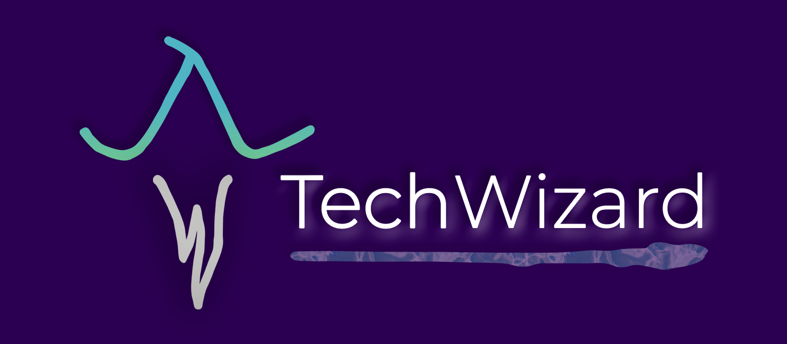

Hi there 👋

My name is Jon-Luke West. I am a designer, an engineer, and a tech wizard :mage:
<!--LinkedIn Learning Courses-->
Check out my courses on [LinkedIn Learning](https://www.linkedin.com/learning/instructors/jon-luke-west)
* [Java with JSON](https://www.linkedin.com/learning/java-with-json)
* [Distributing Your Android App for Kotlin Developers](https://www.linkedin.com/learning/distributing-your-android-app-for-kotlin-developers)
* [Android Development: Retrofit with Java](https://www.linkedin.com/learning/android-development-retrofit-with-java)
* [Android Development Essential Training: Distributing Apps with Java](https://www.linkedin.com/learning/android-development-essential-training-distributing-apps-with-java)
* [Android App Development: Enterprise Integration](https://www.linkedin.com/learning/android-app-development-enterprise-integration)

## :bar_chart: GitHub Stats

## :briefcase: Skills

More Skills

  

  

<!--
**jldubz/jldubz** is a ✨ _special_ ✨ repository because its `README.md` (this file) appears on your GitHub profile.

Here are some ideas to get you started:

- 🔭 I’m currently working on ...
- 🌱 I’m currently learning ...
- 👯 I’m looking to collaborate on ...
- 🤔 I’m looking for help with ...
- 💬 Ask me about ...
- 📫 How to reach me: ...
- 😄 Pronouns: ...
- ⚡ Fun fact: ...
-->
